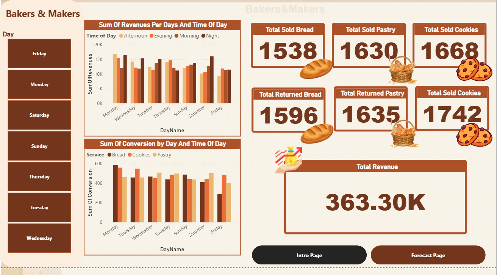
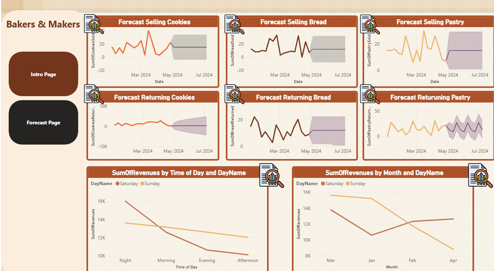

# Bakers & Makers Sales Analysis

A Power BI sales analysis and forecasting project developed for **Bakers & Makers**.

This project is especially meaningful to me because it was **my first freelance project**. It gave me the opportunity to work with a real business-oriented problem, transform raw data into useful insights, and present the results through an interactive Power BI dashboard and a professional analysis report.



## Project Overview

The goal of this project was to analyze bakery sales performance and answer practical business questions related to:

- Revenue performance across different days and times
- Product sales performance
- Weekend sales behavior
- Future sales trends
- Zero-revenue transactions and potential product returns
- Opportunities to improve marketing and business decisions

The analysis focuses on three main product categories:

- Bread
- Pastry
- Cookies

## Business Questions

The project was designed around three main questions:

1. When do weekends generate the most revenue?
2. Which products should be prioritized for Saturday sales?
3. What patterns can be identified in zero-revenue transactions?

## Key Insights

The analysis revealed several useful business insights:

- **Saturday Night** was the strongest revenue period during the weekend.
- **Cookies** achieved the highest sales volume among the analyzed products.
- **Pastry** showed a relatively high rate of zero-revenue transactions.
- New customers generated more zero-revenue transactions than returning customers.
- Higher advertising spend did not always result in higher revenue.
- Some late-night periods showed weaker performance for Bread and Pastry.

## Dashboard

The Power BI dashboard provides an interactive overview of revenue, product performance, and time-based sales patterns.

### Sales Overview


The overview page includes:

- Total revenue
- Units sold by product
- Zero-revenue transaction indicators
- Revenue by day
- Revenue by time of day
- Weekend performance analysis
- Interactive day filtering

### Sales Forecasting



The forecasting page explores future sales patterns for Bread, Pastry, and Cookies using Power BI forecasting visuals.

It also compares historical trends across the different product categories to support inventory and marketing decisions.

## Business Recommendations

Based on the analysis, the following actions were recommended:

- Focus promotions and advertising on high-performing periods, particularly Saturday Night.
- Review Pastry quality, freshness, and inventory management due to its zero-revenue transaction patterns.
- Prioritize high-performing products such as Cookies during strong conversion periods.
- Review advertising campaigns with high spend but low revenue.
- Collect explicit return-reason data to improve future return analysis.
- Track inventory levels more closely to distinguish returns from stock-related or zero-sale events.

## Data Limitation

The original dataset does not contain an explicit **Return Reason** field.

Therefore, transactions with zero revenue were used as a **proxy indicator** when investigating possible returns. These observations should not be interpreted as confirmed product returns.

This limitation was considered when interpreting the results and making recommendations.

## Tools & Skills

| Tool / Skill | Usage |
|---|---|
| Power BI Desktop | Dashboard development and analysis |
| Power Query | Data preparation and transformation |
| DAX | Measures and calculated metrics |
| Data Visualization | Interactive charts and KPI reporting |
| Time Intelligence | Time-based performance analysis |
| Forecasting | Exploration of future sales trends |
| Business Analysis | Insights and actionable recommendations |

## Repository Structure

```text
Bakers-Makers-Sales-Analysis/
│
├── dashboard/
│   └── bakers_makers_dashboard.pbix
│
├── data/
│   └── bakers_makers_sales_data.xlsx
│
├── images/
│   ├── bakers_makers_dashboard_overview.png
│   └── bakers_makers_sales_forecast.png
│
├── report/
│   └── Bakers_Makers_Sales_Analysis.pdf
│
└── README.md
```

## How to Explore the Project

1. Download the `.pbix` file from the `dashboard` folder.
2. Open it using Power BI Desktop.
3. Use the dashboard filters to explore sales performance by day and time.
4. Navigate to the forecasting page to examine product trends.
5. Read the full analysis report in the `report` folder for detailed findings and recommendations.

## What I Learned

As my **first freelance project**, this experience helped me move beyond simply creating charts and focus on solving business problems with data.

I gained practical experience in:

- Translating business questions into analytical tasks
- Preparing and validating business data
- Designing an interactive Power BI dashboard
- Creating DAX measures and KPIs
- Identifying patterns and communicating insights
- Recognizing data limitations instead of making unsupported conclusions
- Turning analytical findings into practical business recommendations

## Author

**Mohamed Tamer**

Data Analysis | Power BI | Data Visualization
